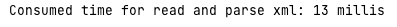
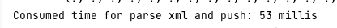
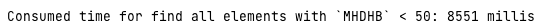

# ParserXML

## Описание

### Главные идеи:

* Проект разработан для вычитывания и разбора документов ``.xml`` и записи данных в базу данных
* Проект был создан в качестве возможного инструментария для полновесного проектного решения.
* Созданы сущности [EDI_DC40](src/main/java/com/example/parser/entity/EDI_DC40.java) и [E1WPA01](src/main/java/com/example/parser/entity/E1WPA01.java) со связью `OneToOne`
* Созданы компонент для парсинга [Parser](src/main/java/com/example/parser/parser/Parser.java) и сервис для работы с данными [Worker](src/main/java/com/example/parser/service/Worker.java)   
* Созданы [тесты для сервиса](src/test/java/com/example/parser/service/XmlWorkerTest.java) и [парсера](src/test/java/com/example/parser/parser/ParserImplTest.java) для проверки производительности.

### Технологичный стек:
* Окружение: `Spring-boot`
* Язык программирования: `Java 11`
* Технология аннотирования классов: `Lombok`
* Технология парсинга: `StAX`
* Инструмент сборки : `maven`
* База данных: `PostgreSQL`

### Описание работы ParserXML:
Интерфейс [Parser](src/main/java/com/example/parser/parser/Parser.java) работает с файлом на который получает в качестве аргумента путь, как строку,
на выходе отдает все сущности, которые сохранил в базу данных.

В интерфейсе [Worker](src/main/java/com/example/parser/service/Worker.java) главным образом схраняется все сущности в базу данных, которые были преобразованы в сущности.

### Тесты
* Производительная оценка чтения данных для файлов размером 1 и 10000 записей:

| Размер файла   |              Производительность               |
|----------------|:---------------------------------------------:|
| 1 запись       |      |
| 10000 записей  |  |

* Производительная оценка чтения и сохранения данных в базу для файлов размером 1 и 10000 записей:

| Размер файла   |         Производительность          |
|----------------|:-----------------------------------:|
| 1 запись       |  |
| 10000 записей  |        |

* Так же разработан и протестирован метод для чтения из базы данных для 10000 сущностей [EDI_DC40](src/main/java/com/example/parser/entity/EDI_DC40.java), в которых значение поля `MHDHB` < 50:

    

